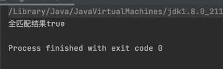
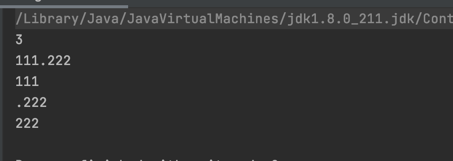

## 正则表达式

### 什么是正则表达式
&emsp;&emsp;正则表达式是一种用来匹配字符串的强有力的武器，它的设计思想是用一种描述性的语言定义一个规则，凡是符合规则的字符串，我们就认为它“匹配”了，否则，该字符串就是不合法的
### 匹配规则


 \*   0次或者多次出现
 \+   1次或者多次出现
 ？  0次或者1次出现
 {n}  n次出现
 {n,} 至少n次出现
 {n,m} n到m（不包含）次出现
 [1-5] 1到5
 [0-9] 表示 0到9 之间的数 包括 0 和 9
 [3-6] 表示 3到6 之间的数 包括 3 和 6
 [a-z] 表示 a-z 之间所有的字母 包含 a 和 z
 [A-Z] 表示 A-Z 之间所有的字母 包含 A 和 Z
 [0-9A-Z] 表示 0 到 9 和 大写A 到 大写 Z 中间所有字符


 x 任意单个字符
 . 除了换行符的任意单个字符
 (ab|cd) ab或者cd
 [abc] a或者b或者c
 
 \d    匹配一个数字字符。等价于[0-9]。
 \D	匹配一个非数字字符。等价于[^0-9]。
 \s	匹配任何空白字符，包括空格、制表符、换页符等等。等价于[ \f\n\r\t\v]。
 \w	匹配包括下划线的任何单词字符。等价于“[A-Za-z0-9_]”。
 \W	匹配任何非单词字符。等价于“[^A-Za-z0-9_]”。
 
 (?i) 表示所在位置右侧的表达式开启忽略大小写模式
 (?s) 表示所在位置右侧的表达式开启单行模式
 (?m) 表示所在位置右侧的表示式开启指定多行模式
 (?is) 更改句点字符 (.) 的含义，以使它与每个字符（而不是除 \n 之外的所有字符）匹配
 (?im) 更改 ^ 和 $ 的含义，以使它们分别与任何行的开头和结尾匹配,而不只是与整个字符串的开头和结尾匹配

### Java中的正则匹配

#### 全匹配

&emsp;&emsp;全匹配比较简单，就是整个字符串进行正则表达式匹配
**例子：**

```
        String testTxt="111.222";
        String pattern = "(\\d{1,3})(\\.(\\d{1,3}))";
        Pattern REGEX_PATTERN = Pattern.compile(pattern);
        Matcher matcher = REGEX_PATTERN.matcher(testTxt);
        /*
           全匹配
         */
        boolean matches = matcher.matches();//true
        System.out.println(matches);
```
**结果如下：**



#### 重点介绍分组匹配

&emsp;&emsp;  在java正则表达式中，（ ）是分组的意思。每一个（ ）代表着一个group捕获组，该组是通过从左至右计算其括号来编号.<br>
&emsp;&emsp; **在表达式（（A）（B（C））），有四个这样的组：**
-  1、((A)(B(C)))
-  2、(A)
-  3、(B(C))
-  4、(C)

**例子：**

```
        String testTxt="111.222";
        String pattern = "(\\d{1,3})(\\.(\\d{1,3}))";
        Pattern REGEX_PATTERN = Pattern.compile(pattern);
        Matcher matcher = REGEX_PATTERN.matcher(testTxt);
        /*
           分组匹配
         */
        while (matcher.find()) {
            System.out.println(matcher.groupCount());
            System.out.println(matcher.group(0)); //整个组的匹配 (\d{1,3})(\.(\d{1,3}))
            System.out.println(matcher.group(1)); //第一个组 (\d{1,3})
            System.out.println(matcher.group(2)); //第二个组 (\.(\d{1,3}))
            System.out.println(matcher.group(3)); //第三个组 (\d{1,3})
        }
```

**结果如下：**


-------
>https://github.com/Rise1024/My-Armory-ForJava
